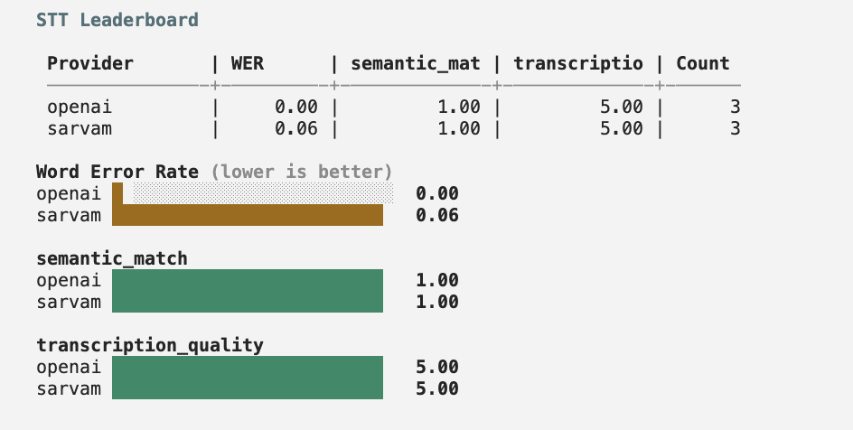
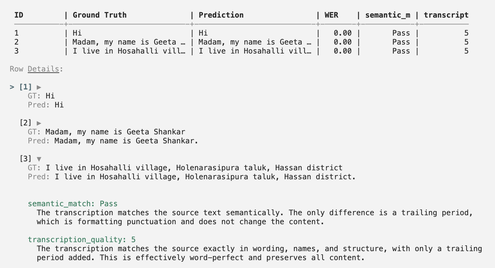

## Get started

```bash
arcval stt
```

<iframe
  className="w-full aspect-video rounded-xl"
  src="https://www.youtube.com/embed/pFdsOMo_J2s"
  title="CLI Speech-to-Text Evaluation Walkthrough"
  allow="accelerometer; autoplay; clipboard-write; encrypted-media; gyroscope; picture-in-picture"
  allowFullScreen
></iframe>

The interactive UI guides you through the full evaluation process:

1. **Language selection** — pick from 10+ supported Indic languages
2. **Provider selection** — choose providers (only those supporting your language are shown)
3. **Input directory** — path to the directory containing your audio files and reference transcripts

The input directory should have this structure:

```
/path/to/data/
├── stt.csv
└── audios/
    ├── audio_1.wav
    └── audio_2.wav
```

The **stt.csv** file contains the reference transcriptions:

| id      | text                            |
| ------- | ------------------------------- |
| audio_1 | Hi                              |
| audio_2 | Madam, my name is Geeta Shankar |

<Note>
  All audio files should be in WAV format. The evaluation script expects files
  at `audios/<id>.wav` where `<id>` matches the `id` column in your CSV.
</Note>

Refer to the [sample dataset](https://github.com/ARTPARK-SAHAI-ORG/calibrate/blob/main/examples/stt/sample_input) for a template.

4. **Output directory** — where results will be saved (defaults to `./out`)
5. **API keys** — enter the API keys for the selected providers

The evaluation runs providers in parallel (max 2 at a time), showing the transcriptions as they are generated.

## Evaluator configuration

By default, a text LLM judge — routed through [OpenRouter](https://openrouter.ai/) (set `OPENROUTER_API_KEY` in your environment) — evaluates whether each transcription matches the reference text semantically using the built-in **`semantic_match`** evaluator; expand **Default evaluator: semantic_match** below for the exact `system_prompt` from the codebase. You can customize the judge model and add multiple evaluators by passing an optional config file with `--config`:

```bash
arcval stt -p deepgram google -i ./data -o ./out --config config.json
```

Each evaluator's `system_prompt` is sent as the system message to its own dedicated LLM judge call (one call per evaluator, run in parallel). The user message contains the source/transcription pair.

The config file supports:

```json
{
  "evaluators": [
    {
      "id": "semantic-match-id",
      "name": "semantic_match",
      "system_prompt": "You are a highly accurate evaluator. You will be given a source text and a transcription. Mark True if the values represented by both strings match semantically.",
      "judge_model": "openai/gpt-5.4-mini"
    },
    {
      "id": "completeness-id",
      "name": "completeness",
      "system_prompt": "You are a highly accurate evaluator. You will be given a source text and a transcription. Mark True if all information from the source text is present in the transcription.",
      "judge_model": "openai/gpt-5.4-mini"
    }
  ]
}
```

| Key                          | Type   | Description                                                                                                                                       |
| ---------------------------- | ------ | ------------------------------------------------------------------------------------------------------------------------------------------------- |
| `evaluators`                 | array  | List of evaluators. Each one becomes its own LLM call per row.                                                                                    |
| `evaluators[].id`            | string | Optional unique id. Output `config.json` includes the raw `evaluators` list and an `evaluators_map` from id to name.                              |
| `evaluators[].name`          | string | Unique evaluator name. Becomes the column name in the leaderboard.                                                                                |
| `evaluators[].system_prompt` | string | Full system prompt used for this evaluator's LLM judge call.                                                                                      |
| `evaluators[].judge_model`   | string | OpenRouter model id for this evaluator (default: `openai/gpt-5.4-mini`). Use any model in the [OpenRouter catalog](https://openrouter.ai/models). |

Each evaluator also accepts:

| Key         | Type    | Description                                                |
| ----------- | ------- | ---------------------------------------------------------- |
| `type`      | string  | `"binary"` (default) or `"rating"`                         |
| `scale_min` | integer | Required when `type` is `"rating"`. Lowest allowed score.  |
| `scale_max` | integer | Required when `type` is `"rating"`. Highest allowed score. |

Binary evaluators produce per-row pass/fail and a mean pass-rate. Rating evaluators produce an integer score on your scale and a mean score in the leaderboard.

When multiple evaluators are defined, each is scored independently — one LLM call per evaluator per row, all run in parallel — and appears as a separate column in the results and leaderboard.

Refer to the [sample config](https://github.com/ARTPARK-SAHAI-ORG/calibrate/blob/main/examples/stt/config.json) for a template.

<Note>
  The `--config` flag is optional. When omitted, a single built-in
  `semantic_match` evaluator scores semantic match between source and
  transcription.
</Note>

<AccordionGroup>
  <Accordion title="semantic_match (default evaluator system prompt)">
    Matches [`DEFAULT_STT_EVALUATOR`](https://github.com/ARTPARK-SAHAI-ORG/calibrate/blob/main/arcval/judges.py) in `arcval/judges.py` when no `--config` is passed.

    ```text
    You are a highly accurate evaluator evaluating the transcription output of an STT model.

    You will be given two strings - one is the source string used to produce an audio and the other is the transcription of that audio.

    You need to evaluate if the two strings are the same.

    # Important Instructions:
    - Check whether the values represented by both the strings match. E.g. if one string says 1,2,3 but the other string says "one, two, three" or "one, 2, three", they should be considered the same as their underlying value is the same. However, if the actual values itself are different, e.g. for the name of a person or address or the value of any other key detail - that difference should be noted.
    - Ignore differences like a word being split up into more than 1 word by spaces. Look at whether the values mean the same in both the strings.
    - Minor differences in values of entities (e.g. proper nouns, numbers) matter and should be considered an error.
    - If all the "values" for the strings match, mark it as True. Else, False.
    ```

  </Accordion>
</AccordionGroup>

## Output

Once all the providers have completed, it displays a leaderboard measuring key metrics along with bar charts for better visualization.

<Frame>
  
</Frame>

You can also view the generated transcript and metrics for each row of your dataset including the LLM judge score and reasoning.

<Frame>
  
</Frame>

<Card
  title="Learn more about metrics"
  icon="chart-bar"
  href="/core-concepts/speech-to-text#metrics"
>
  Detailed explanation of all metrics and why using an LLM Judge is necessary
</Card>

## Resources

<Card title="Integrations" icon="microphone" href="/integrations/stt">
  See the full list of supported providers and their configuration options
</Card>
