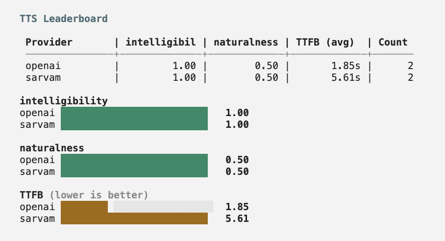
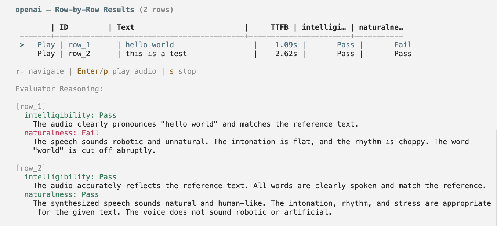

## Get started

```bash
calibrate tts
```

<iframe
  className="w-full aspect-video rounded-xl"
  src="https://www.youtube.com/embed/cMYGuAT8BM8"
  title="CLI Text-to-Speech Evaluation Walkthrough"
  allow="accelerometer; autoplay; clipboard-write; encrypted-media; gyroscope; picture-in-picture"
  allowFullScreen
></iframe>

The interactive UI guides you through the full evaluation process:

1. **Language selection** — pick from 10+ supported Indic languages
2. **Provider selection** — choose providers (only those supporting your language are shown)
3. **Input CSV** — path to CSV file with `id` and `text` columns

The **input CSV** should have this format:

| id    | text                    |
| ----- | ----------------------- |
| row_1 | hello world             |
| row_2 | this is a test          |
| row_3 | how are you doing today |

Refer to [this sample](https://github.com/ARTPARK-SAHAI-ORG/calibrate/blob/main/examples/tts/sample.csv) for a template.

4. **Output directory** — where results will be saved (defaults to `./out`)
5. **API keys** — enter the API keys for the selected providers

The evaluation runs providers in parallel (max 2 at a time), showing the progress as audio files are generated.

## Evaluator configuration

By default, an audio LLM judge — routed through [OpenRouter](https://openrouter.ai/) (set `OPENROUTER_API_KEY` in your environment) — evaluates whether the reference text is pronounced correctly in the synthesized audio using the built-in **`pronunciation`** evaluator; expand **Default evaluator: pronunciation** below for the exact `system_prompt` from the codebase. You can customize the judge model and add multiple evaluators by passing an optional config file with `--config`:

```bash
calibrate tts -p openai google -i sample.csv -o ./out --config config.json
```

Each evaluator's `system_prompt` is sent as the system message to its own dedicated audio LLM judge call (one call per evaluator, run in parallel). The user message contains the reference text and the audio sample.

The config file supports:

```json
{
  "evaluators": [
    {
      "name": "intelligibility",
      "system_prompt": "You are a highly accurate evaluator. You will be given an audio sample and the reference text it is supposed to speak. Mark True if the spoken text is clearly understandable from the audio.",
      "judge_model": "openai/gpt-audio"
    },
    {
      "name": "pronunciation",
      "system_prompt": "You are a highly accurate evaluator. You will be given an audio sample and the reference text it is supposed to speak. Mark True only if all words are pronounced correctly with natural-sounding speech.",
      "judge_model": "openai/gpt-audio"
    }
  ]
}
```

| Key                          | Type   | Description                                                                                                                                                                                                                                                                                                                                                                         |
| ---------------------------- | ------ | ----------------------------------------------------------------------------------------------------------------------------------------------------------------------------------------------------------------------------------------------------------------------------------------------------------------------------------------------------------------------------------- |
| `evaluators`                 | array  | List of evaluators. Each one becomes its own audio LLM call per row.                                                                                                                                                                                                                                                                                                                |
| `evaluators[].name`          | string | Unique evaluator name. Becomes the column name in the leaderboard.                                                                                                                                                                                                                                                                                                                  |
| `evaluators[].system_prompt` | string | Full system prompt used for this evaluator's audio LLM judge call.                                                                                                                                                                                                                                                                                                                  |
| `evaluators[].judge_model`   | string | OpenRouter model id for this evaluator (default: `openai/gpt-audio`). Must be an audio-capable model in the [OpenRouter catalog](https://openrouter.ai/models) — for example OpenAI’s audio models or Google’s Gemini audio-capable entries; the [sample config](https://github.com/ARTPARK-SAHAI-ORG/calibrate/blob/main/examples/tts/config.json) uses `google/gemini-2.5-flash`. |

Each evaluator also accepts:

| Key         | Type    | Description                                                |
| ----------- | ------- | ---------------------------------------------------------- |
| `type`      | string  | `"binary"` (default) or `"rating"`                         |
| `scale_min` | integer | Required when `type` is `"rating"`. Lowest allowed score.  |
| `scale_max` | integer | Required when `type` is `"rating"`. Highest allowed score. |

Binary evaluators produce per-row pass/fail and a mean pass-rate. Rating evaluators produce an integer score on your scale and a mean score in the leaderboard.

When multiple evaluators are defined, each is scored independently — one audio LLM call per evaluator per row, all run in parallel — and appears as a separate column in the results and leaderboard.

Refer to the [sample config](https://github.com/ARTPARK-SAHAI-ORG/calibrate/blob/main/examples/tts/config.json) for a template.

<Note>
  The `--config` flag is optional. When omitted, a single built-in
  `pronunciation` evaluator scores audio intelligibility. The TTS judge requires
  an audio-capable model.
</Note>

<AccordionGroup>
  <Accordion title="pronunciation (default evaluator system prompt)">
    Matches [`DEFAULT_TTS_EVALUATOR`](https://github.com/ARTPARK-SAHAI-ORG/calibrate/blob/main/calibrate/judges.py) in `calibrate/judges.py` when no `--config` is passed.

    ```text
    You are a highly accurate evaluator evaluating the audio output of a TTS model.

    You will be given the audio and the text that should have been spoken in the audio.

    You need to evaluate if the text is easily understandable from the audio. Check whether the spoken words match the reference text and the audio is clear enough to convey the intended message.
    ```

  </Accordion>
</AccordionGroup>

## Output

Once all the providers have completed, it displays a leaderboard measuring key metrics along with bar charts for better visualization.

<Frame>
  
</Frame>

You can also view the generated audio and metrics for each row of your dataset including the LLM judge score and reasoning. Use the arrow keys to navigate rows and press **Enter** or **p** to play the generated audio.

<Frame>
  
</Frame>

<Card
  title="Learn more about metrics"
  icon="chart-bar"
  href="/core-concepts/text-to-speech#metrics"
>
  Detailed explanation of all metrics and how LLM Judge works
</Card>

## Resources

<Card title="Integrations" icon="volume-high" href="/integrations/tts">
  See the full list of supported providers and their configuration options
</Card>
