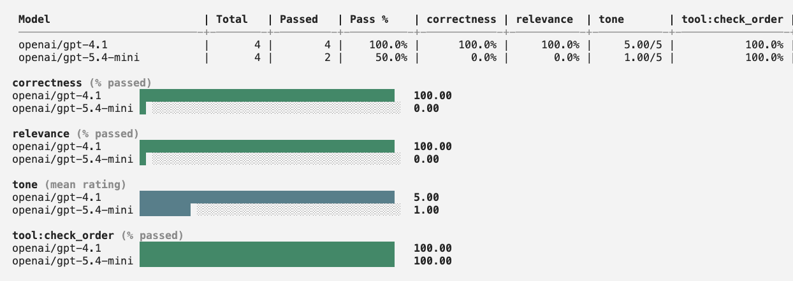
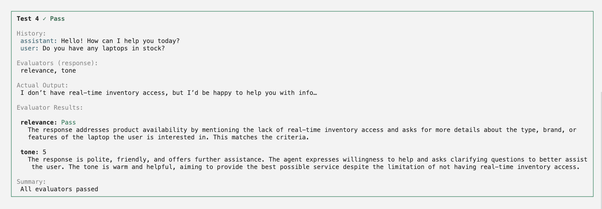

<iframe
  className="w-full aspect-video rounded-xl"
  src="https://www.youtube.com/embed/OQfmkkU9Fj0"
  title="CLI LLM tests Walkthrough"
  allow="accelerometer; autoplay; clipboard-write; encrypted-media; gyroscope; picture-in-picture"
  allowFullScreen
></iframe>

## Set up your agent

There are two ways to run LLM evaluations:

- **Calibrate agent** — define your agent inside the config file and evaluate across models.
- **Agent connection** — connect your existing agent via HTTP and run tests against it directly.

### Calibrate agent

Define your agent's system prompt and tools directly in the config file. Calibrate runs the evaluation using an LLM of your choice.

Refer to [this sample](https://github.com/ARTPARK-SAHAI-ORG/calibrate/blob/main/examples/llm/config-internal-agent.json) for a full template.

#### `system_prompt`

The system prompt that defines your agent's behavior. This is the same prompt you use in production.

```
You are a helpful customer support assistant for an online store.

You help customers with:
1. Checking order status
2. Processing returns
3. Answering product questions
```

#### `tools`

A list of tools available to your agent. See the guide on [Configuring Tools](/guides/configuring-tools) for how to set it up along with examples for different tool types.

### Agent connection

If you already have an agent running, you can connect calibrate directly to it instead of redefining your agent's system prompt and tools.

Refer to [this sample](https://github.com/ARTPARK-SAHAI-ORG/calibrate/blob/main/examples/llm/config-external-agent.json) for a full template.

#### Connect your agent

| Key             | Required | Description                                                 |
| --------------- | -------- | ----------------------------------------------------------- |
| `agent_url`     | Yes      | The URL calibrate will make a POST request to               |
| `agent_headers` | No       | HTTP headers included in every request — typically for auth |

```json
{
  "agent_url": "https://your-agent.com/chat",
  "agent_headers": {
    "Authorization": "Bearer YOUR_API_KEY"
  }
}
```

#### Request format

Calibrate will make a POST request to your `agent_url` with the following body:

```json
{
  "messages": [
    { "role": "assistant", "content": "Hello! How can I help you?" },
    { "role": "user", "content": "Check order ORD-12345" }
  ]
}
```

When benchmarking across models, a `model` field is added so your agent can route to the right model:

```json
{
  "messages": [...],
  "model": "gemma-4-26b-a4b-it"
}
```

To enable benchmarking multiple models, your API must support the `model` field and you must implement the model routing in your agent. The easiest way is to use an existing framework like `OpenRouter` and select among a wide range of models.

#### Response format

Your agent must return a JSON response with at least one of these keys:

| Key          | Type           | Description                  |
| ------------ | -------------- | ---------------------------- |
| `response`   | string or null | The agent's text reply       |
| `tool_calls` | array          | Tool calls made by the agent |

Each item in `tool_calls` must have:

```json
{
  "tool": "function_name",
  "arguments": { "key": "value" }
}
```

#### Verify your connection

Before running evaluations, you can verify that your agent endpoint is reachable and returns the expected format:

```bash
calibrate llm --verify --agent-url https://your-agent.com/chat --agent-headers '{"Authorization": "Bearer YOUR_API_KEY"}'
```

This sends a test message and checks that the response matches the required format, printing a clear error if something is wrong.

---

## Test cases

An array of test cases to evaluate your agent on. Each test case has:

| Key          | Type   | Description                                                                       |
| ------------ | ------ | --------------------------------------------------------------------------------- |
| `id`         | string | Optional unique test-case id. When provided, results include `test_case_id`.       |
| `history`    | array  | Conversation history as context for the agent to generate the next output         |
| `evaluation` | object | The criteria for evaluating the agent's output — either a tool call or a response |

**Tool call test** — verifies the agent calls the correct tool with expected arguments:

```jsonc
{
  // tool_call test
  "id": "test-id-1",
  "history": [
    { "role": "assistant", "content": "Hello! How can I help you today?" },
    {
      "role": "user",
      "content": "I want to check my order status. My order ID is ORD-12345.",
    },
  ],
  "evaluation": {
    "type": "tool_call",
    "tool_calls": [
      {
        "tool": "check_order",
        "arguments": {
          "order_id": "ORD-12345",
        },
      },
    ],
  },
}
```

<Note>
  Passing `"arguments": null` will make the agent simply check if the tool is
  called without checking the arguments.
</Note>

**Response test** — verifies the agent's response meets the criteria defined (evaluated by an LLM judge):

```jsonc
{
  // response test — implicit default correctness evaluator (string criteria)
  "id": "test-id-1",
  "history": [
    { "role": "assistant", "content": "Hello! How can I help you today?" },
    { "role": "user", "content": "What's the weather like?" },
  ],
  "evaluation": {
    "type": "response",
    "criteria": "The assistant should politely redirect the conversation back to store-related topics.",
  },
}
```

For agent connection, your agent owns its tools internally — there is no need to define them in the config. The `history` and `evaluation` keys work identically for both setup options.

---

## Evaluators

**Response** test cases can be evaluated by one or more text LLM judges (routed through [OpenRouter](https://openrouter.ai/), set `OPENROUTER_API_KEY` in your environment).

Each evaluator's `system_prompt` is sent to its own dedicated LLM judge call (one call per evaluator, run in parallel) with the conversation history and the agent's last response as the inputs.

### Defining custom evaluators

Define one or more evaluators at the top level and reference them by name from each test case. Each evaluator is an independent LLM call and produces its own column in the leaderboard:

```jsonc
{
  "evaluators": [
    {
      "id": "accuracy-id",
      "name": "accuracy",
      "system_prompt": "You are a highly accurate evaluator. You will be given a conversation and the agent's final response. Mark True if the response is factually correct and relevant.",
      "judge_model": "openai/gpt-4.1"
    },
    {
      "id": "tone-id",
      "name": "tone",
      "system_prompt": "You are a highly accurate evaluator. You will be given a conversation and the agent's final response. Rate the tone on a 1-5 scale: 1 = rude/robotic, 3 = neutral, 5 = warm and helpful.",
      "judge_model": "openai/gpt-4.1",
      "type": "rating",
      "scale_min": 1,
      "scale_max": 5
    }
  ],
  "test_cases": [
    {
      // response — custom named evaluators (accuracy + tone)
      "id": "test-id-1",
      "history": [...],
      "evaluation": {
        "type": "response",
        "criteria": [
          { "name": "accuracy" },
          { "name": "tone" }
        ]
      }
    }
  ]
}
```

### Using the default evaluator

The simplest setup needs no top-level `evaluators`. Pass `criteria` as a string and the implicit `correctness` evaluator runs. The string is substituted into the default evaluator's system prompt as the `{{criteria}}` variable:

```jsonc
{
  // response — implicit default correctness evaluator (string criteria only)
  "evaluation": {
    "type": "response",
    "criteria": "The assistant should politely redirect to store-related topics.",
  },
}
```

<AccordionGroup>
  <Accordion title="correctness (default evaluator system prompt)">
    When you omit top-level `evaluators` and pass a string `criteria`, this is the implicit evaluator from [`DEFAULT_LLM_TEST_EVALUATOR`](https://github.com/ARTPARK-SAHAI-ORG/calibrate/blob/main/calibrate/judges.py) that is used by default. Your `criteria` string is substituted for `{{criteria}}`.

    ```text
    You are a highly accurate evaluator evaluating the response of an agent to a user's message.

    You will be given a conversation between a user and an agent along with the response of the agent to the final user message.

    You need to evaluate if the response adheres to the evaluation criteria:

    {{criteria}}
    ```

  </Accordion>
</AccordionGroup>

| Key                          | Type    | Description                                                                                                                        |
| ---------------------------- | ------- | ---------------------------------------------------------------------------------------------------------------------------------- |
| `evaluators`                 | array   | Top-level list of evaluators. Each one becomes its own LLM call per test case.                                                     |
| `evaluators[].id`            | string  | Optional unique id. Results echo it as `evaluator_id`; output `config.json` includes raw `evaluators` and an `evaluators_map`.       |
| `evaluators[].name`          | string  | Unique evaluator name. Test cases reference it via `evaluation.criteria[].name`.                                                   |
| `evaluators[].system_prompt` | string  | Full system prompt for this evaluator. Supports `{{variable}}` placeholders that are substituted from the test case's `arguments`. |
| `evaluators[].judge_model`   | string  | OpenRouter model id for this evaluator (default: `openai/gpt-5.4-mini`).                                                           |
| `evaluators[].type`          | string  | `"binary"` (default) or `"rating"`.                                                                                                |
| `evaluators[].scale_min`     | integer | Required when `type` is `"rating"`. Lowest allowed score.                                                                          |
| `evaluators[].scale_max`     | integer | Required when `type` is `"rating"`. Highest allowed score.                                                                         |

### Variable substitution

A test case can pass `arguments` to an evaluator. Each `{{variable}}` placeholder in the evaluator's `system_prompt` is replaced with the matching value before the judge call:

```jsonc
{
  "evaluators": [
    {
      "id": "correctness-id",
      "name": "correctness",
      "system_prompt": "You are a highly accurate evaluator. Evaluate whether the agent's response satisfies: {{criteria}}",
      "judge_model": "openai/gpt-4.1"
    }
  ],
  "test_cases": [
    {
      // response — custom correctness evaluator with {{criteria}} substituted from arguments
      "history": [...],
      "evaluation": {
        "type": "response",
        "criteria": [
          { "name": "correctness", "arguments": { "criteria": "Politely redirect off-topic questions." } }
        ]
      }
    }
  ]
}
```

The string-form `criteria` (shown in the quickstart above) is just a shortcut for the implicit `correctness` evaluator with `{ "arguments": { "criteria": "<your string>" } }`.

### Binary vs rating

Binary evaluators produce per-row pass/fail and a mean pass-rate in aggregates. Rating evaluators report **mean/min/max** scores per model on the leaderboard.

At **test-case pass/fail** time, **every referenced evaluator must pass**: binary evaluators require `match: true`, and rating evaluators require the numeric **`score` to equal `scale_max`** (anything lower fails that evaluator). So on a 1–5 scale (`scale_min` 1, `scale_max` 5), only a judge score of **5** counts as pass — intermediate scores fail unless they hit the top of your declared scale.

If you want thresholds different from “top-of-scale” (for example “tone at least 4”), encode that as a **binary** evaluator whose `system_prompt` asks the judge explicitly (for example: “Mark True if and only if tone is at least 4 on a 1–5 scale”).

---

## Full examples

<AccordionGroup>
  <Accordion title="Calibrate agent example">
    Same structure as [`examples/llm/config-internal-agent.json`](https://github.com/ARTPARK-SAHAI-ORG/calibrate/blob/main/examples/llm/config-internal-agent.json), with documentation-only `//` comments before each test case (`jsonc` — strip comments if you paste into a strict JSON parser).

    ```jsonc
    {
      "system_prompt": "You are a helpful customer support assistant for an online store.\n\nYou help customers with:\n1. Checking order status\n2. Processing returns\n3. Answering product questions\n\nWhen a customer asks about their order, call the `check_order` webhook tool with their order ID to fetch the status.\n\nWhen a customer provides feedback or sentiment during the conversation, call the `log_interaction` tool to record the interaction type and sentiment.\n\nBe friendly, helpful, and concise in your responses.",
      "tools": [
        {
          "type": "client",
          "name": "log_interaction",
          "description": "Log customer interaction details including the type of inquiry and customer sentiment",
          "parameters": [
            {
              "id": "interaction_type",
              "type": "string",
              "description": "Type of customer interaction: order_inquiry, return_request, product_question, complaint, or general",
              "required": true
            },
            {
              "id": "sentiment",
              "type": "string",
              "description": "Customer sentiment: positive, neutral, or negative",
              "required": true
            }
          ]
        },
        {
          "type": "webhook",
          "name": "check_order",
          "description": "Check the status of a customer order by order ID",
          "parameters": [ ],
          "webhook": {
            "method": "GET",
            "url": "https://api.example.com/orders",
            "timeout": 10,
            "headers": [ { "name": "Authorization", "value": "Bearer API_KEY" } ],
            "queryParameters": [
              {
                "id": "order_id",
                "type": "string",
                "description": "The customer's order ID",
                "required": true
              }
            ]
          }
        }
      ],
      "evaluators": [
        {
          "id": "relevance-id",
          "name": "relevance",
          "system_prompt": "You are a highly accurate evaluator evaluating the response to a conversation.\n\nYou will be given a conversation between a user and a human agent along with the response of the human agent to the final user message.\n\nMark True if the assistant's response is about product availability or asks for more details about the laptop.",
          "judge_model": "openai/gpt-4.1"
        },
        {
          "id": "tone-id",
          "name": "tone",
          "system_prompt": "You are a highly accurate evaluator evaluating the response to a conversation.\n\nYou will be given a conversation between a user and a human agent along with the response of the human agent to the final user message.\n\nRate the tone on a 1-5 scale: 1 = rude/robotic, 3 = neutral, 5 = warm and helpful.",
          "judge_model": "openai/gpt-4.1",
          "type": "rating",
          "scale_min": 1,
          "scale_max": 5
        }
      ],
      "test_cases": [
        {
          // tool_call — expect check_order (webhook)
          "id": "test-tool-call-1",
          "history": [
            {
              "role": "assistant",
              "content": "Hello! How can I help you today?"
            },
            {
              "role": "user",
              "content": "I want to check my order status. My order ID is ORD-12345."
            }
          ],
          "evaluation": {
            "type": "tool_call",
            "tool_calls": [
              {
                "tool": "check_order",
                "arguments": { "query": {
                    "order_id": "ORD-12345"
                  }
                }
              }
            ]
          }
        },
        {
          // tool_call — expect log_interaction (client tool)
          "id": "test-tool-call-2",
          "history": [
            {
              "role": "assistant",
              "content": "Hello! How can I help you today?"
            },
            {
              "role": "user",
              "content": "I'm really happy with my recent purchase! The product quality is amazing."
            }
          ],
          "evaluation": {
            "type": "tool_call",
            "tool_calls": [
              {
                "tool": "log_interaction",
                "arguments": {
                  "interaction_type": "general",
                  "sentiment": "positive"
                }
              }
            ]
          }
        },
        {
          // response — implicit default correctness evaluator (string criteria); independent of named evaluators below
          "id": "test-response-1",
          "history": [
            {
              "role": "assistant",
              "content": "Hello! How can I help you today?"
            },
            {
              "role": "user",
              "content": "What's the weather like?"
            }
          ],
          "evaluation": {
            "type": "response",
            "criteria": "The assistant should politely redirect the conversation back to store-related topics and explain it can only help with order inquiries, returns, and product questions."
          }
        },
        {
          // response — custom named evaluators (relevance + tone from top-level evaluators)
          "id": "test-response-2",
          "history": [
            {
              "role": "assistant",
              "content": "Hello! How can I help you today?"
            },
            {
              "role": "user",
              "content": "Do you have any laptops in stock?"
            }
          ],
          "evaluation": {
            "type": "response",
            "criteria": [
              { "name": "relevance" },
              { "name": "tone" }
            ]
          }
        }
      ]
    }
    ```

  </Accordion>

  <Accordion title="Agent connection example">
    Same structure as [`examples/llm/config-external-agent.json`](https://github.com/ARTPARK-SAHAI-ORG/calibrate/blob/main/examples/llm/config-external-agent.json), with documentation-only `//` comments before each test case (`jsonc` — strip comments if you paste into a strict JSON parser).

    ```jsonc
    {
      "agent_url": "https://your-agent.com/chat",
      "agent_headers": {
        "Authorization": "Bearer YOUR_API_KEY"
      },
      "test_cases": [
        {
          // tool_call — expect check_order
          "id": "test-tool-call-1",
          "history": [
            {
              "role": "assistant",
              "content": "Hello! How can I help you today?"
            },
            {
              "role": "user",
              "content": "I want to check my order status. My order ID is ORD-12345."
            }
          ],
          "evaluation": {
            "type": "tool_call",
            "tool_calls": [
              {
                "tool": "check_order",
                "arguments": {
                  "order_id": "ORD-12345"
                }
              }
            ]
          }
        },
        {
          // tool_call — expect log_interaction
          "id": "test-tool-call-2",
          "history": [
            {
              "role": "assistant",
              "content": "Hello! How can I help you today?"
            },
            {
              "role": "user",
              "content": "I'm really happy with my recent purchase! The product quality is amazing."
            }
          ],
          "evaluation": {
            "type": "tool_call",
            "tool_calls": [
              {
                "tool": "log_interaction",
                "arguments": {
                  "interaction_type": "general",
                  "sentiment": "positive"
                }
              }
            ]
          }
        },
        {
          // response — implicit default correctness evaluator (string criteria)
          "id": "test-response-1",
          "history": [
            {
              "role": "assistant",
              "content": "Hello! How can I help you today?"
            },
            {
              "role": "user",
              "content": "What's the weather like?"
            }
          ],
          "evaluation": {
            "type": "response",
            "criteria": "The assistant should politely redirect the conversation back to store-related topics and explain it can only help with order inquiries, returns, and product questions."
          }
        },
        {
          // response — implicit default correctness evaluator (string criteria)
          "id": "test-response-2",
          "history": [
            {
              "role": "assistant",
              "content": "Hello! How can I help you today?"
            },
            {
              "role": "user",
              "content": "Do you have any laptops in stock?"
            }
          ],
          "evaluation": {
            "type": "response",
            "criteria": "The assistant should respond helpfully about product availability or ask for more details about what specific laptop the customer is looking for."
          }
        }
      ]
    }
    ```

  </Accordion>
</AccordionGroup>

---

## Get started

### Interactive mode

Run `calibrate llm` with no arguments to launch the interactive UI:

```bash
calibrate llm
```

**Calibrate agent** — the UI detects that your config defines a system prompt and tools and guides you through:

1. **Config file** — path to your config file
2. **Provider** — OpenRouter or OpenAI
3. **Model entry** — enter model names one at a time (single or multiple)
4. **Confirm models** — review the list and add more or proceed
5. **Output directory** — where results will be saved (defaults to `./out`)
6. **API keys** — enter the API keys for the selected provider

The evaluation runs the selected models in parallel (max 2 at a time), showing results for each test as they complete.

**Agent connection** — the UI detects `agent_url` in your config and switches to agent mode:

_Single test:_

1. **Config file** — path to your config file (with `agent_url` and optionally `agent_headers`)
2. **Mode** — select "Single test"
3. **Verify** — calibrate verifies the connection; shows success or failure with the option to go back
4. **Output directory** — where results will be saved (defaults to `./out`)
5. **API keys** — only `OPENAI_API_KEY` is required (used by the LLM judge)

_Benchmark across models:_

1. **Config file** — path to your config file (with `agent_url` and optionally `agent_headers`)
2. **Mode** — select "Benchmark across models"
3. **Model entry** — enter a model name; calibrate verifies the connection with that model before asking if you want to add another
4. **Confirm models** — review the list and add more or proceed
5. **Output directory** — where results will be saved (defaults to `./out`)
6. **API keys** — only `OPENAI_API_KEY` is required (used by the LLM judge)

### Non-interactive mode

**Calibrate agent:**

Single model:

```bash
calibrate llm -c config.json -m openai/gpt-4.1 -p openrouter -o ./out
```

Multiple models (benchmark — runs in parallel, generates a leaderboard):

```bash
calibrate llm -c config.json -m openai/gpt-4.1 claude-sonnet-4-5 -p openrouter -o ./out
```

**Agent connection:**

Your config must include `agent_url` and optionally `agent_headers`:

```json
{
  "agent_url": "https://your-agent.com/chat",
  "agent_headers": {
    "Authorization": "Bearer YOUR_API_KEY"
  }
}
```

Single run (use the default model of the agent):

```bash
calibrate llm -c config.json -o ./out
```

Calibrate verifies the connection before running. Results are saved directly to the output directory.

Benchmark across models — calibrate verifies the connection for each model, then runs the test suite once per model. The model name is included in each request so your agent can route to the right model:

```bash
calibrate llm -c config.json -m gemma-4-26b-a4b-it gpt-4o -o ./out
```

Each model gets its own results folder, and a summary with pass rates for all models is printed at the end.

**Skip verification:**

Pass `--skip-verify` to skip the agent connection verification step. This is useful in CI/automation pipelines where you've already confirmed the agent is reachable:

```bash
calibrate llm -c config.json -o ./out --skip-verify
```

```bash
calibrate llm -c config.json -m gemma-4-26b-a4b-it gpt-4o -o ./out --skip-verify
```

## Output

Once all the models have completed, it displays a leaderboard with pass rates (% of tests passed) and bar charts for visualization.

<Frame>
  
</Frame>

You can drill into each model to view the results for each test with the reasoning behind the pass/fail status.

<Frame>
  
</Frame>

## Resources

<Card title="Integrations" icon="volume-high" href="/integrations/llm">
  See the full list of supported providers and their configuration options
</Card>
